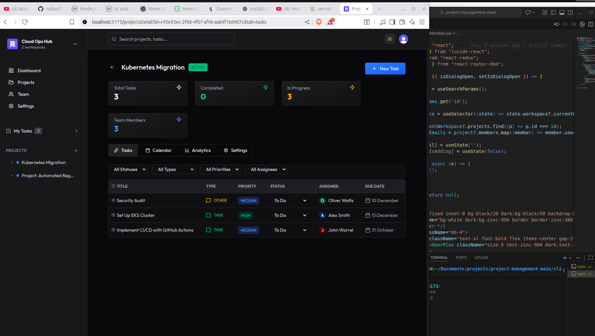

# 📌 Project Management System (PMS)

A simple, modern, and reliable Project Management System built to help teams track tasks, manage deadlines, and collaborate with ease.  
This app blends solid old-school management principles with clean Gen-Z level UI/UX and workflow.  

---
<p align="center">
  
</p>

## 🚀 Features

### 🔐 Authentication
- User registration & login (Clerk)
- JWT-based secure session handling
- Inngest user sync (created, updated, deleted)

### 📁 Project Management
- Create, update, and delete projects  
- Assign tasks to specific users  
- Track progress the traditional way (To-Do → Doing → Done)

### ✔️ Task Management
- Task creation & assignment
- Status updates
- Commenting & descriptions  
- Optional attachments (Cloudinary or local uploads)

### 👥 Team Collaboration
- Manage team members  
- Real-time updates with modern tooling  
- Smooth workflow for daily operations

---

## 🛠️ Tech Stack

### **Backend**
- Node.js  
- Express  
- Prisma ORM (PostgreSQL / MySQL / PlanetScale / Neon)  
- Inngest (Event-based user sync)
- Clerk (Authentication provider)

### **Frontend**
- React + Vite  
- Zustand / Redux (state management)  
- TailwindCSS (UI)

### **Deployment**
- Vercel (Frontend + Serverless backend)
- Cloudinary (Media uploads)

---

## 📦 Installation & Setup

Clone repo:

```bash
git clone https://github.com/your-username/project-management.git
cd project-management
